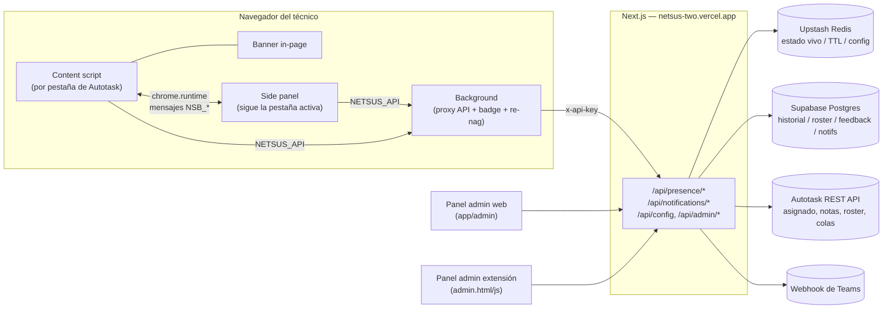

# Autotask CoView

Sistema de detección de colisiones de tickets en Autotask PSA: cuando dos técnicos
trabajan al mismo tiempo sobre el mismo ticket, ambos se enteran en el momento —
en vez de descubrirlo después, cuando ya se sobrescribieron notas o el cliente
recibió dos respuestas distintas.

Se compone de una **extensión de Chrome** (sin modificar Autotask) más un
**backend serverless** en Vercel que arbitra la presencia de cada técnico.

## Tabla de contenidos

- [Qué hace](#qué-hace)
- [Arquitectura](#arquitectura)
- [Componentes](#componentes)
  - [Extensión de Chrome](#extensión-de-chrome-ticket_lock_wxt)
  - [Backend (Next.js / Vercel)](#backend-nextjs--vercel-app-src)
  - [Almacenamiento](#almacenamiento)
  - [Integración con Autotask REST API](#integración-con-autotask-rest-api)
- [Flujo de detección de colisión](#flujo-de-detección-de-colisión)
- [Sistema de notificaciones n1–n5](#sistema-de-notificaciones-n1n5)
- [Seguridad](#seguridad)
- [Referencia de endpoints](#referencia-de-endpoints)
- [Claves de Redis](#claves-de-redis)
- [Tablas de Supabase](#tablas-de-supabase)
- [Variables de entorno](#variables-de-entorno)
- [Desarrollo local](#desarrollo-local)
- [Tests](#tests)
- [Build y deploy](#build-y-deploy)
- [Limitaciones conocidas](#limitaciones-conocidas)

## Qué hace

Cuando un técnico abre un ticket en Autotask, la extensión registra su presencia
contra el backend. Si otro técnico abre el mismo ticket mientras el primero sigue
ahí:

- Ambos ven un **banner inyectado en la propia página de Autotask** (superior
  para la colisión, inferior para el aviso de "asignado a") con nombre, avatar y
  tiempo del otro técnico, más botones **Avisar** / **Pausar** (5·15·30 min) /
  **Terminé** / **Minimizar** / **Quitar**.
- El campo de edición del ticket queda visualmente bloqueado para quien llegó
  después (`pointer-events` + opacidad, no altera datos de Autotask).
- Se registra el evento en el historial (Supabase), se manda una alerta a Teams
  (si hay webhook configurado) y, opcionalmente, se crea una nota en el propio
  ticket de Autotask.
- El **side panel** de Chrome (ícono de la extensión) muestra el mismo estado
  con más detalle, el buzón de notificaciones y los ajustes (nombre, sonido,
  tema, feedback).
- Dos **paneles de administración** (uno dentro de la extensión, otro web en
  `netsus-two.vercel.app/admin`) muestran en vivo quién está en qué ticket,
  historial filtrable/exportable, analítica agregada, roster de técnicos y
  configuración (webhook de Teams, TTL de presencia, notas automáticas,
  contraseña de admin).

## Arquitectura



## Componentes

### Extensión de Chrome (`ticket_lock_wxt/`)

Framework [WXT](https://wxt.dev) (Manifest V3). Permisos: `storage`,
`notifications`, `sidePanel`, `tabs`; `host_permissions` solo hacia
`netsus-two.vercel.app`.

| Archivo | Rol |
|---|---|
| `entrypoints/content.ts` | Corre en cada pestaña de Autotask. Detecta ticket/usuario, hace polling de presencia cada 5s, decide el estado (`idle/solo/collision/liberated/paused`) y lo empuja por mensajes al side panel y al banner. |
| `lib/banner.ts` | Renderer del banner inyectado en la página (una capa más sobre el mismo estado, sin mensajería propia). |
| `lib/avatar.ts` | Avatar de iniciales compartido entre el banner y el side panel. |
| `entrypoints/sidepanel/main.ts` | Página de extensión que sigue la pestaña activa; pide/recibe estado vía `chrome.tabs.sendMessage`, muestra buzón de notificaciones y ajustes. |
| `entrypoints/background.ts` | Único punto que hace `fetch()` real al backend (proxy `NETSUS_API`); actualiza el badge del ícono, hace polling del feed n1–n5 y re-nag de respaldo si no hay pestaña de Autotask abierta. |
| `lib/notifications.ts` | Buzón de notificaciones compartido (`chrome.storage.local`), dedupe, re-nag. |
| `lib/prefs.ts` | Tema (auto/claro/oscuro) y mute por tipo de notificación. |
| `lib/messaging.ts` | Único archivo de tipos del protocolo `NSB_STATE` / `NSB_ACTION` / `NSB_REQUEST_STATE` entre content script y side panel. |
| `public/admin.html` + `admin.js` | Panel de administración propio de la extensión (JS plano, sin bundler) — pestañas En vivo/Historial/Análisis/Recursos/Config. |

El ticketId real se lee de la URL, pero la **identidad usada para detectar
colisiones** es el número de ticket (leído de `document.title`, más estable):
en la vista "workspace" de Autotask con varios tickets abiertos, el id de la
URL (`ids[0]=`) puede diferir entre dos técnicos aunque miren el mismo ticket —
ver el comentario en `content.ts` (`presenceId()`).

### Backend (Next.js / Vercel, `app/`, `src/`)

Next.js 16 (App Router), TypeScript, desplegado en Vercel. Toda la lógica de
servidor vive en `app/api/**/route.ts` + helpers en `src/lib/`. Ver
[Referencia de endpoints](#referencia-de-endpoints).

Módulos clave en `src/lib/`:

| Archivo | Rol |
|---|---|
| `ticket-lock.ts` | Cliente Redis compartido + `checkApiKey()`. |
| `admin-auth.ts` | Sesión de admin (`checkAdminSession`/`createAdminSession`) y rate limit de `/api/admin/auth`. |
| `collision.ts` | Lógica pura de colisión: normalización de nombres, dedupe, formato de duración — testeada con Vitest. |
| `num.ts` | `clampInt()` — parseo seguro de config numérica desde Redis. |
| `history-filter.ts` | Filtros de historial (período/técnico/búsqueda) + export CSV, usados por el panel web. |
| `autotask.ts` | Cliente de la API REST de Autotask (query de tickets/notas/recursos, creación de notas, resolución de nombre↔resourceID). |
| `notif-poll.ts` | Poller n1–n5 (lock-guarded) + feed por-recurso + log central de notificaciones. |
| `supabase/client.ts` | Cliente Supabase (service role, server-only). |
| `supabase/resources.ts` | Sync del roster desde Autotask + `lookupResourceId()` (nombre → UUID de Supabase). |

Panel admin web: `app/admin/page.tsx` — pestañas En vivo / Historial (con
filtros, paginación y export CSV) / Análisis / Recursos / Centro de
Notificaciones / Feedback / Config.

### Almacenamiento

- **Upstash Redis** — estado vivo con TTL (presencia, colisión en curso, rate
  limits, sesiones de admin) y config runtime (`config:*`). Ver
  [Claves de Redis](#claves-de-redis).
- **Supabase (Postgres)** — historial durable de colisiones, roster de
  técnicos, feedback y notificaciones (sin tope, a diferencia de las listas de
  Redis que reemplazaron). RLS activado sin políticas — el cliente server-side
  usa la service-role key para saltárselo a propósito.

### Integración con Autotask REST API

`src/lib/autotask.ts` habla con `webservices12.autotask.net/ATServicesRest/v1.0`
usando `AUTOTASK_USER`/`AUTOTASK_SECRET`. Funciones: consultar tickets por cola/
asignado/ID, leer notas de cliente (señal de "respondió el cliente" para n3),
resolver nombre↔resourceID (cacheado 7 días en Redis), sincronizar el roster de
recursos activos, y **crear una nota** en el ticket cuando se detecta o resuelve
una colisión (detrás del toggle `config:autotask_notes_enabled`, apagado por
defecto — los valores de tipo/visibilidad de nota son picklists propios de cada
instancia y deben validarse antes de activarlo en producción).

## Flujo de detección de colisión

1. Técnico A abre el ticket → `content.ts` registra presencia
   (`POST /api/presence/{id}`) y arranca un poll cada 5s.
2. Técnico B abre el mismo ticket → su propio `POST /api/presence/{id}`
   devuelve `others: [A]`.
3. El servidor detecta que es una colisión nueva (`colactive:*` no existía):
   guarda en `collision_history` (Supabase), incrementa el contador histórico,
   manda el webhook de Teams, registra la notificación central y —si está
   habilitado— crea la nota en Autotask.
4. Ambos ven el banner de colisión (in-page) y el side panel actualizado;
   B puede **Avisar** (empuja un ping a A), **Pausar** su presencia, o
   **Terminé** (libera y sale).
5. Cuando A sale del ticket (`DELETE /api/presence/{id}`) y quedan <2
   presencias, el servidor calcula la duración, completa la fila de
   `collision_history`, notifica la resolución (Teams + nota opcional) y B ve
   el banner "El ticket está libre".

## Sistema de notificaciones n1–n5

Poller server-side (`runPoll()` en `notif-poll.ts`), disparado por
`GET /api/notifications/poll` (cron de Vercel o llamada manual) y también de
forma oportunista cuando un técnico hace poll de su feed
(`GET /api/notifications?user=`). Lock-guardado con Redis (`notif:poll_lock`,
50s) para que solo corra un ciclo aunque lo disparen varios clientes a la vez.

| Tipo | Qué detecta |
|---|---|
| n1 (`n1_queue`) | Ticket nuevo en una cola vigilada (`config:watch_queues`). |
| n2 (`n2_assign`) | Ticket recién asignado al técnico. |
| n3 (`n3_client`) | El cliente respondió (nota nueva creada por un contacto). |
| n4 (`n4_sla`) | SLA de primera respuesta o resolución por vencer/vencido. |
| n5 (`n5_critical`) | Ticket con prioridad crítica (`config:critical_priorities`) en una cola vigilada. |

## Seguridad

- **`x-api-key`** (`TICKET_LOCK_API_KEY`) — embebido en la extensión pública;
  gatea todos los endpoints. Es una limitación estructural conocida: cualquiera
  que descompile la extensión puede extraer esta key.
- **Sesión de admin** (`x-admin-token`) — emitida por `POST /api/admin/auth`
  tras validar la contraseña, TTL 12h en Redis. Se exige *además* del
  `x-api-key` en las acciones administrativas/destructivas (borrar historial,
  cambiar config, sincronizar roster, cambiar contraseña), justamente porque el
  `x-api-key` por sí solo no alcanza para esas acciones.
- **Rate limit** en `/api/admin/auth` — 5 intentos fallidos / 5 min por IP.
- La contraseña de admin vive en `config:admin_password` (Redis) salvo que la
  env var `ADMIN_PASSWORD` esté seteada, en cuyo caso esta última manda siempre
  (ver `app/api/admin/auth/route.ts`).

## Referencia de endpoints

| Ruta | Métodos | Auth | Qué hace |
|---|---|---|---|
| `/api/presence/[id]` | GET, POST, DELETE | `x-api-key` | Núcleo de detección de colisión: lista/registra/libera presencia por ticket. |
| `/api/presence/status` | GET | `x-api-key` | Todos los tickets ocupados ahora mismo, con minutos por técnico. |
| `/api/presence/history` | GET, DELETE | GET: `x-api-key` · DELETE: + admin | Historial paginado/filtrable (GET); borrado total (DELETE, irreversible). |
| `/api/presence/analytics` | GET | `x-api-key` | Métricas agregadas (por técnico/hora/día, pares, duración). |
| `/api/presence/daily-summary` | GET | `x-api-key` o `Bearer CRON_SECRET` | Resumen diario, opcionalmente enviado a Teams. |
| `/api/notifications` | GET | `x-api-key` | Poll del feed n1–n5 de un técnico (`?user=`). |
| `/api/notifications/poll` | GET | `x-api-key` o `Bearer CRON_SECRET` | Dispara un ciclo del poller n1–n5. |
| `/api/notifications/log` | GET | `x-api-key` | Feed central de notificaciones de todo el equipo. |
| `/api/team/online` | GET | `x-api-key` | Cantidad de técnicos con la extensión activa. |
| `/api/feedback` | GET, POST | `x-api-key` | Listar / enviar feedback de técnicos. |
| `/api/resources/sync` | POST | `x-api-key` + admin | Resincroniza el roster desde Autotask. |
| `/api/config` | GET, POST | GET: `x-api-key` · POST: + admin | Leer/escribir configuración runtime. |
| `/api/admin/auth` | POST | ninguno (login) | Valida contraseña y emite sesión de admin. |
| `/api/admin/change-password` | POST | `x-api-key` + admin | Cambia la contraseña de admin (Redis). |

## Claves de Redis

| Prefijo | TTL | Contenido |
|---|---|---|
| `ticketpresence:{id}:{user}` | config (15–300s, def. 40s) | Marca de presencia activa. |
| `ticketentry:{id}:{user}` | 300s (renovado) | Timestamp de primera entrada — "quién llegó primero". |
| `ticketnumber:{id}` / `ticketurl:{id}` | 300s | Número/URL del ticket, cacheados. |
| `autotaskid:{id}` | 300s | ID numérico real de Autotask (para crear la nota de resolución en el DELETE). |
| `colactive:{id}:{user}` | 120s (renovado) | Marca que la colisión ya se registró (evita duplicar el evento). |
| `colstart:{id}` / `colusers:{id}` | 600s (renovado) | Inicio y participantes de la colisión en curso. |
| `colcount:{id}` | 180 días | Contador histórico de colisiones del ticket. |
| `colsupaid:{id}` | 600s | ID de la fila de Supabase abierta, para completar `duration_ms` al resolver. |
| `pingrate:{id}:{user}` / `ping:{id}:{target}` | 30s / 60s | Rate limit y bandeja de "avisos" pendientes. |
| `ticketassigned:{id}` | 300s | Nombre del asignado en Autotask, cacheado. |
| `config:*` | sin TTL | Config runtime (webhook, TTL, colas, prioridades, SLA, toggles, contraseña). |
| `adminsession:{token}` | 12h | Sesión de admin. |
| `adminauth:fail:{ip}` | 5 min | Contador de intentos fallidos de login. |
| `notif:poll_lock` / `notif:lastpoll` | 50s / — | Lock y marca de tiempo del poller n1–n5. |
| `team:resources` | — (ZSET) | Recursos con extensión activa, score = último visto. |
| `notif:feed:{resourceId}` | 24h, máx 50 | Feed pendiente por técnico. |
| `notif:seen:{dedupeKey}` | 6h/24h según tipo | Dedupe de eventos ya emitidos. |
| `resource:byname:{nombre}` / `resource:byid:{id}` | 7 días | Cache nombre↔resourceID de Autotask. |

## Tablas de Supabase

| Tabla | Contenido |
|---|---|
| `collision_history` | Una fila por colisión (detección → resolución con `duration_ms`). |
| `collision_participants` | Relación N:M colisión↔técnico conocido. |
| `resources` | Roster de técnicos sincronizado desde Autotask. |
| `notifications` | Copia durable del feed central (una fila por destinatario). |
| `feedback` | Feedback enviado desde la extensión. |

## Variables de entorno

| Variable | Dónde se usa | Para qué |
|---|---|---|
| `UPSTASH_REDIS_REST_URL` / `UPSTASH_REDIS_REST_TOKEN` | `src/lib/ticket-lock.ts` (`Redis.fromEnv()`) | Cliente Redis. |
| `TICKET_LOCK_API_KEY` | `src/lib/ticket-lock.ts` | Key que manda la extensión en `x-api-key`. |
| `SUPABASE_URL` / `SUPABASE_SERVICE_ROLE_KEY` | `src/lib/supabase/client.ts` | Cliente Supabase server-side (bypassea RLS a propósito). |
| `AUTOTASK_USER` / `AUTOTASK_SECRET` | `src/lib/autotask.ts` | Autenticación contra la API REST de Autotask. |
| `ADMIN_PASSWORD` | `app/api/admin/auth`, `app/api/admin/change-password` | Contraseña de admin fija por entorno (prioridad sobre la guardada en Redis). |
| `CRON_SECRET` | `app/api/notifications/poll`, `app/api/presence/daily-summary` | Secreto para el cron de Vercel (alternativa al `x-api-key`). |

## Desarrollo local

**Backend:**

```bash
npm install
npm run dev      # next dev
npm run lint      # eslint
npm run test      # vitest run
npm run build     # next build
```

**Extensión:**

```bash
cd ticket_lock_wxt
npm install
npm run dev       # wxt (carga en Chrome con recarga en caliente)
npm run compile   # tsc --noEmit
```

> **Gotcha de build**: `wxt build`/`wxt zip` puede levantar sin querer el
> `postcss.config.js` de Tailwind del proyecto Next.js raíz. Si eso pasa, crea
> temporalmente `ticket_lock_wxt/postcss.config.mjs` con
> `export default { plugins: {} };`, compila, y bórralo después.

## Tests

`npm run test` (Vitest) cubre la lógica pura extraída a `src/lib/`: detección
de colisión (`collision.ts`), parseo de config (`num.ts`), SLA (`notif-poll.ts`)
y filtros de historial (`history-filter.ts`). No hay tests end-to-end del
content script/banner (requieren una pestaña real de Autotask).

## Build y deploy

- **Backend**: `vercel --prod` (o el deploy automático de Vercel al pushear a
  `main`). Variables de entorno definidas en el dashboard de Vercel.
- **Extensión**: `npx wxt zip` genera
  `ticket_lock_wxt/.output/autotask-collision-detection-1.0.0-chrome.zip`,
  listo para subir a Chrome Web Store o cargar sin empaquetar en
  `chrome://extensions`.

## Limitaciones conocidas

- El `x-api-key` de la extensión es público por diseño (viene embebido en un
  cliente instalable) — la mitigación es que las acciones destructivas exigen
  además una sesión de admin, no que el key en sí sea secreto.
- La nota automática en Autotask depende de picklists (`noteType`/`publish`)
  que varían por instancia — validar antes de habilitar `config:autotask_notes_enabled`
  en producción.
- El panel admin de la extensión y el panel web tienen implementaciones
  paralelas (JS plano vs. React) — mismo feature set, pero cualquier cambio de
  UI/lógica de negocio compartida (historial, analítica, config) se edita en
  ambos lados.

---

Desarrollado por Netsus · Innovación Tecnológica — 2026
